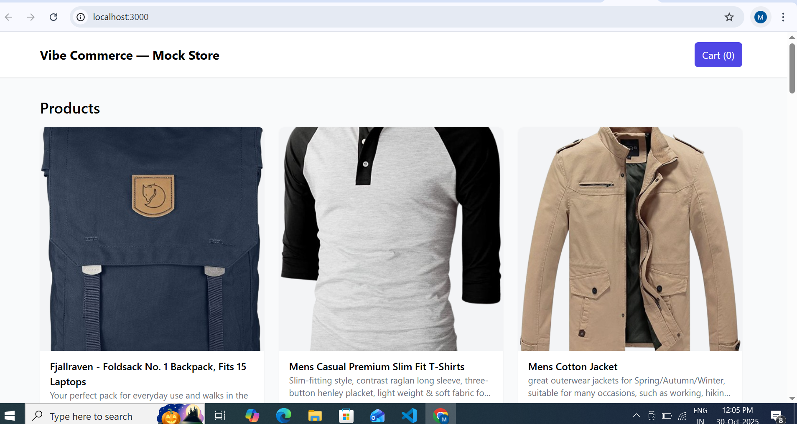
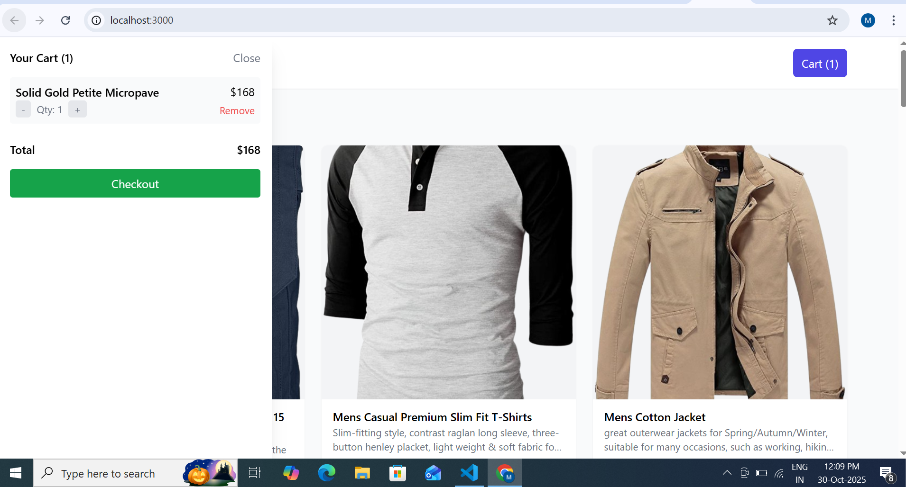
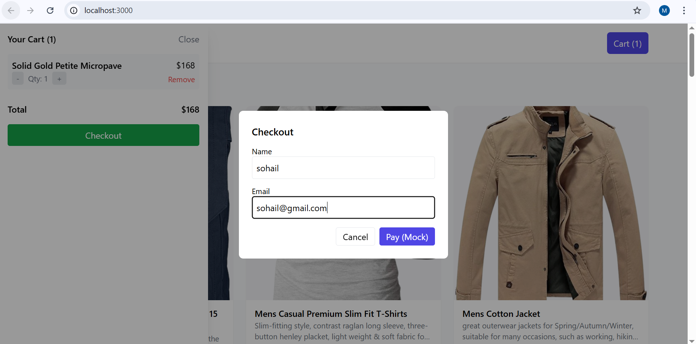
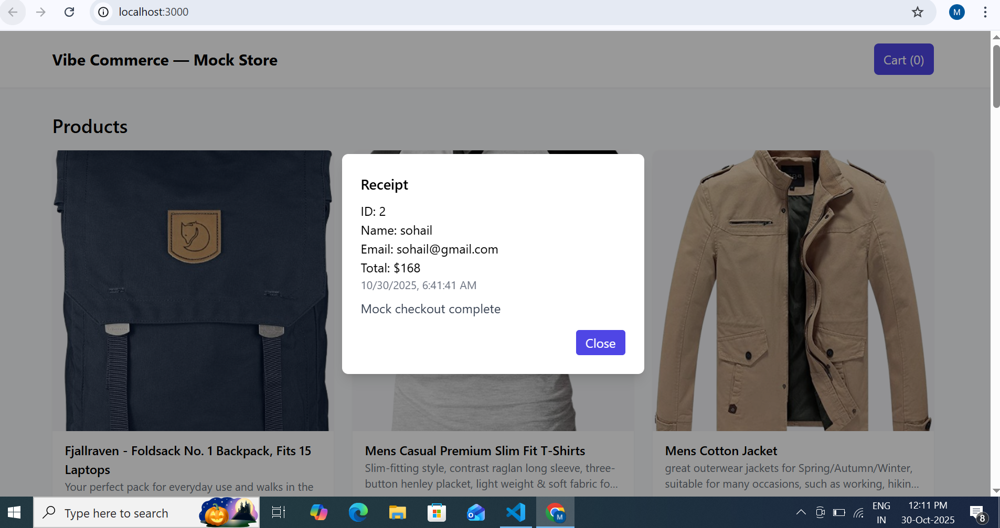

# 🛍️ Vibe Commerce — Mock Store

A **basic full-stack e-commerce cart app** built for the **Vibe Commerce screening**.  
It demonstrates full CRUD functionality for a shopping cart with mock checkout, testing end-to-end integration between **React (frontend)**, **Node/Express (backend)**, and **SQLite/MongoDB (database)**.

---

## 🚀 Features

### 🧠 Backend (Node + Express)
- **GET /api/products** → Returns 5–10 mock products (id, name, price).  
- **POST /api/cart** → Add `{ productId, qty }` to cart.  
- **DELETE /api/cart/:id** → Remove a cart item by ID.  
- **GET /api/cart** → Retrieve cart with total price.  
- **POST /api/checkout** → Accepts `{ cartItems }` and returns a mock receipt (total + timestamp).  
- Optional DB persistence using **SQLite**.

### 💻 Frontend (React + Tailwind)
- Product grid with **“Add to Cart”** buttons.  
- Cart view: show items, quantities, and total.  
- Remove or update quantities easily.  
- Simple checkout form (name + email).  
- **Responsive** and mobile-friendly design.  
- **Mock receipt modal** after checkout.

---

## 📁 Folder Structure

Vibe Commerce — Mock Store/
│
├── backend/
│ ├── index.js
│ ├── db/ (optional SQLite DB)
│ ├── routes/
│ ├── controllers/
│ ├── package.json
│ └── ...
│
├── frontend/
│ ├── src/
│ ├── public/
│ ├── package.json
│ └── ...
│
├── package.json (root - runs both frontend & backend)
└── README.md


---

## ⚙️ Tech Stack

| Layer | Technology |
|-------|-------------|
| **Frontend** | React, Axios, Tailwind CSS |
| **Backend** | Node.js, Express |
| **Database** | SQLite (can switch to MongoDB) |
| **Dev Tools** | Concurrently, Nodemon |

---

## 🧩 Installation & Setup

### 1️⃣ Clone the Repository
```bash
git clone https://github.com/Mohdsohail7/Basic-Mock-E-Com-Cart.git
cd "Vibe Commerce — Mock Store"
```

# Install Dependencies

### Backend:
```bash
cd backend
npm install
```

### Frontend:
```bash
Frontend
```

## Root (for concurrently):
```bash
cd ..
npm install
```

## Run the App (Development Mode)

### From the root folder, simply run:
```bash
npm run dev
```


| Method | Endpoint        | Description               |
| ------ | --------------- | ------------------------- |
| GET    | `/api/products` | List all mock products    |
| POST   | `/api/cart`     | Add an item to the cart   |
| DELETE | `/api/cart/:id` | Remove a specific item    |
| GET    | `/api/cart`     | Get cart contents & total |
| POST   | `/api/checkout` | Generate mock receipt     |


## Environment Variables
Create a .env file inside /backend (optional):
```bash
PORT=4000
```

# 📸 Screenshots
### Product Grid


### Cart View



### Checkout Modal


### recipe Modal


🎥 Demo Video
https://www.loom.com/share/fb9fe500160a4d32bb6cf6196d3b65a9

👨‍💻 Author
Mohd Sohail
🔗 [GitHub Profile](https://github.com/Mohdsohail7)
📧 [sohailmohd437@gmail.com](mailto:sohailmohd437@gmail.com)


## 🪪 License
This project is licensed under the ISC License — feel free to use or modify for learning/demo purposes.


